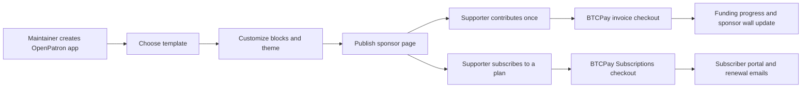

<p align="center">
  
</p>

<p align="center">
  <a href="https://github.com/b0l0k/BTCPayServer.Plugins.OpenPatron/actions/workflows/dotnet.yml">
    
  </a>
  
  
  <a href="LICENSE">
    
  </a>
</p>

<h1 align="center">OpenPatron</h1>

<p align="center">
  <strong>Beautiful, self-hosted sponsor pages for open-source maintainers, built directly into BTCPay Server.</strong>
</p>

<p align="center">
  Turn support into a public movement: one-time contributions, recurring sponsorships, BTCPay-powered payment methods, funding progress, supporter walls, GitHub-aware project cards, and embeddable badges - all powered by your own BTCPay Server.
</p>

<p align="center">
  <a href="#why-openpatron"><strong>Why it matters</strong></a>
  &nbsp;|&nbsp;
  <a href="#features"><strong>Features</strong></a>
  &nbsp;|&nbsp;
  <a href="#quickstart"><strong>Quickstart</strong></a>
  &nbsp;|&nbsp;
  <a href="#local-development"><strong>Development</strong></a>
</p>

---

## The pitch

OpenPatron gives builders the missing sponsorship layer for BTCPay Server.

If you maintain open-source software, publish research, build public infrastructure, or fund a community project, you should not have to send supporters to a rented platform just to make your work sustainable. OpenPatron lets you host a polished patronage page in your own BTCPay Server instance, keep the payment relationship direct, and tell the story of the work with pages that feel alive.

It is not a donation button. It is a sponsorship experience.

## Why OpenPatron

| The usual problem | The OpenPatron answer |
| --- | --- |
| Sponsorship pages live on closed platforms | Pages live inside your BTCPay Server app system |
| One-time tips and recurring plans are fragmented | One page can expose both flows |
| Supporters cannot see momentum | Funding progress and sponsor walls make progress visible |
| README sponsorship links feel bolted on | Built-in badge endpoint gives every project a sponsor call-to-action |
| Customization usually means custom code | Visual blocks, page themes, templates, and JSON mode |
| Project credibility is hard to show | GitHub project cards enrich repo metadata at render time |

## Features

| Capability | What it gives you |
| --- | --- |
| Beautiful sponsor pages | Publish a branded page at `/apps/{appId}/openpatron` with templates, blocks, themes, and Markdown |
| Recurring sponsorships | Use BTCPay Server Subscriptions for monthly, quarterly, yearly, or lifetime plans |
| One-time contributions | Create BTCPay invoices with a dedicated OpenPatron payment flow |
| Flexible payment methods | Accept whatever your BTCPay store supports, including Bitcoin, Lightning, and plugin-based methods such as [Tether USDt](https://github.com/btcpayserver-tether/BTCPayServer.Plugins.USDt) |
| Funding momentum | Show settled contribution totals, funding progress, and recent supporter activity |
| GitHub project showcase | Enrich open-source project cards with GitHub stars and language |
| Embeddable sponsor badge | Add a lightweight sponsor badge to GitHub READMEs and project websites |

## The experience

OpenPatron is designed around a simple journey:

1. Create an `OpenPatron` app in a BTCPay Server store.
2. Pick a starting template: `Personal`, `Project`, or `Empty`.
3. Shape the page with blocks, layout presets, theme settings, or JSON.
4. Connect the page to a subscription offering and plans.
5. Publish the public page and share the sponsor badge anywhere.
6. Let BTCPay Server handle invoices, checkout, subscriptions, email rules, and payment status.



## Page blocks

OpenPatron pages are assembled from reusable blocks. Each block stores its own settings in the app configuration and renders through a Razor partial.

| Block | Use it for |
| --- | --- |
| `profile-hero` | Avatar, maintainer name, bio, GitHub, X, Mastodon, and Nostr links |
| `project-hero` | Project headline, subtitle, maintainer identity, and support badges |
| `funding-progress` | A funding goal with live settled-contribution totals |
| `description` | Markdown-formatted narrative sections |
| `projects-grid` | Project cards, including GitHub stars and language when available |
| `subscription-tiers` | Active subscription plans from the linked offering |
| `quick-support` | Suggested one-time contribution amounts |
| `sponsor-wall` | Recent settled contributions |
| `one-time-payment` | Compact sidebar payment panel |

## Built for BTCPay Server

OpenPatron is a native BTCPay Server plugin. It registers a new app type, appears in store navigation, stores settings through BTCPay's app settings mechanism, and relies on BTCPay's existing invoice and subscription primitives.

That means:

- No custom database schema for page settings.
- No separate sponsorship backend to operate.
- No new payment custody layer.
- No duplicate subscription engine.
- No extra public service required for sponsor pages.

The plugin integrates with:

- `AppService` for app creation, routing, and settings.
- `UIInvoiceController` for one-time invoice checkout.
- BTCPay Server Subscriptions for recurring plans and subscriber portals.
- BTCPay Server Emails for welcome and renewal flows.
- `IMemoryCache` and GitHub's API for repository metadata enrichment.

## Payment methods

OpenPatron does not lock sponsorship into a single currency or network. One-time contributions are standard BTCPay invoices, and recurring sponsorships are routed through BTCPay Server Subscriptions. The checkout experience can therefore use the payment methods enabled on the store.

That includes Bitcoin and Lightning by default, plus compatible BTCPay payment plugins. For example, stores can add Tether support through the [BTCPay Server USDt plugin](https://github.com/btcpayserver-tether/BTCPayServer.Plugins.USDt) and expose that option to supporters when the store and checkout are configured for it.

## Quickstart

### Requirements

- BTCPay Server `2.0.0` or newer.
- .NET SDK `10.0.x` for development.
- The BTCPay Server source submodule initialized under `submodules/btcpayserver`.

### Clone

```bash
git clone --recurse-submodules https://github.com/b0l0k/BTCPayServer.Plugins.OpenPatron.git
cd BTCPayServer.Plugins.OpenPatron
```

If you already cloned without submodules:

```bash
git submodule update --init --recursive
```

### Build

```bash
dotnet build BTCPayServer.Plugins.OpenPatron.Tests/BTCPayServer.Plugins.OpenPatron.Tests.csproj -m:1
```

### Run fast tests

```bash
dotnet test --no-build --verbosity normal --filter "Playwright!=Playwright" BTCPayServer.Plugins.OpenPatron.Tests/BTCPayServer.Plugins.OpenPatron.Tests.csproj
```

## Local development

Build the plugin, generate BTCPay Server debug-plugin wiring, then start the BTCPay Server submodule:

```bash
dotnet build BTCPayServer.Plugins.OpenPatron/BTCPayServer.Plugins.OpenPatron.csproj -c Altcoins-Debug
dotnet run --project ConfigBuilder/ConfigBuilder.csproj -c Altcoins-Debug
cd submodules/btcpayserver
./run.sh
```

`ConfigBuilder` writes `submodules/btcpayserver/BTCPayServer/appsettings.dev.json` with a `DEBUG_PLUGINS` entry pointing to the compiled OpenPatron DLL.

## Architecture

```text
BTCPayServer.Plugins.OpenPatron/
+-- OpenPatronPlugin.cs            Plugin entry point and DI registration
+-- OpenPatronAppType.cs           BTCPay app type, configure link, public link
+-- Controllers/
|   +-- UIOpenPatronController.cs  Admin editor, public page, checkout routes, schema, badge
+-- Models/
|   +-- OpenPatronAppSettings.cs   Persisted app settings, sections, theme, offering link
|   +-- BlockSettings.cs           Per-block settings models
+-- Services/
|   +-- BlockRegistry.cs           Block metadata, layout presets, default templates
|   +-- FundingProgressService.cs  Settled invoice totals
|   +-- SponsorWallService.cs      Recent settled contribution lookup
|   +-- GitHubRepoService.cs       GitHub repo metadata enrichment
+-- Views/UIOpenPatron/
|   +-- Update.cshtml              Admin page builder
|   +-- PublicPage.cshtml          Public sponsor page shell
|   +-- Blocks/                    Block partials
+-- BTCPayServer.Plugins.OpenPatron.Tests/
|   +-- FastTests.cs               Unit and serialization coverage
|   +-- PlaywrightTests.cs         Browser-flow coverage
+-- ConfigBuilder/
    +-- Program.cs                 Local debug-plugin configuration generator
```

For deeper implementation notes, see [Docs/ARCHITECTURE.md](Docs/ARCHITECTURE.md).

## Data model

OpenPatron stores page configuration in BTCPay Server's app settings JSON:

```text
OpenPatronAppSettings
+-- PageLayoutPreset
+-- Sections[]
|   +-- Blocks[]
|       +-- Id
|       +-- Type
|       +-- Settings
|       +-- Theme
+-- Theme
+-- OfferingId
+-- DefaultCurrency
```

Runtime data is resolved when the public page renders:

- Funding totals come from settled invoices tagged to the app.
- Sponsor wall entries come from recent settled contribution invoices.
- Subscription cards come from the linked BTCPay Server Subscriptions offering.
- GitHub project metadata is fetched and cached for one hour.

## Public endpoints

| Endpoint | Purpose |
| --- | --- |
| `GET /apps/{appId}/openpatron` | Public sponsor page |
| `POST /apps/{appId}/openpatron/contribute` | Create one-time contribution invoice |
| `POST /apps/{appId}/openpatron/plans/{planId}/subscribe` | Create subscription checkout |
| `GET /apps/{appId}/openpatron/portal` | Redirect subscriber to sponsor portal |
| `GET /apps/{appId}/openpatron/badge.svg` | Render embeddable sponsor badge |
| `GET /apps/openpatron/schema.json` | Render page-layout JSON Schema |

## Roadmap ideas

OpenPatron already has the foundation for a serious patronage product. High-impact next steps could include:

- Gallery-quality page themes and template presets.
- Import/export for reusable sponsor-page layouts.
- Richer public sponsor profiles and supporter attribution controls.
- Analytics for conversion, recurring revenue, and project momentum.
- More embeddable widgets for external project websites.

## Contributing

This project is MIT licensed and built in the open. Issues, pull requests, design feedback, and real-world maintainer use cases are welcome.

Recommended local checks:

```bash
dotnet build BTCPayServer.Plugins.OpenPatron.Tests/BTCPayServer.Plugins.OpenPatron.Tests.csproj -m:1
dotnet test --no-build --verbosity normal --filter "Playwright!=Playwright" BTCPayServer.Plugins.OpenPatron.Tests/BTCPayServer.Plugins.OpenPatron.Tests.csproj
```

Releases are intended to be built by the BTCPay Server plugin builder when a semantic version tag is pushed.

## License

[MIT](LICENSE)
